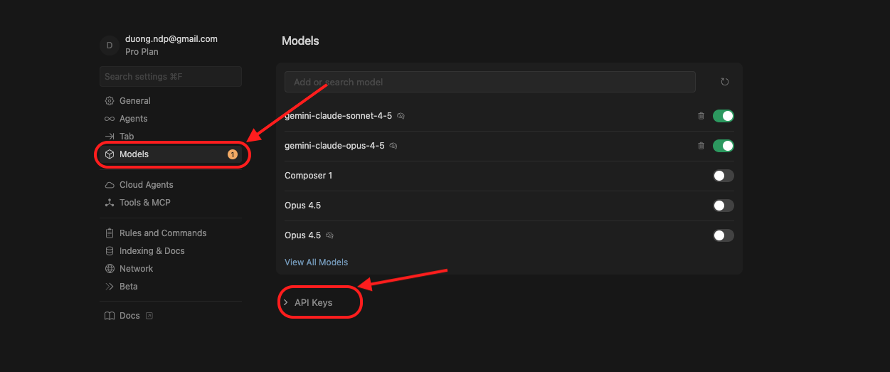
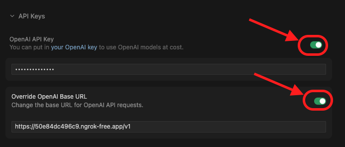
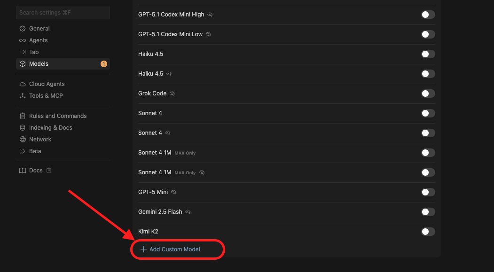

# Hướng dẫn Cấu hình Custom API trên Cursor

Tài liệu này hướng dẫn chi tiết cách kết nối Cursor với một Custom API Provider (ví dụ: OpenRouter, Local LLM, hoặc Proxy riêng) và thêm model tùy chỉnh.

## Các bước thực hiện

### Bước 1: Mở trình soạn thảo Cursor
Khởi động ứng dụng Cursor trên máy tính của bạn.

---

### Bước 2: Truy cập Cài đặt (Settings)
Tại giao diện chính, nhấn vào biểu tượng bánh răng **(Settings)** ở góc trên bên phải (hoặc góc dưới bên trái tùy phiên bản), hoặc sử dụng phím tắt `Ctrl + ,` (Windows) / `Cmd + ,` (Mac).

---

### Bước 3: Mở tab Models
Trong cửa sổ **Cursor Settings**, nhìn sang menu bên trái và chọn mục **Models**. Đây là nơi quản lý các LLM được sử dụng trong editor.



---

### Bước 4: Cấu hình API Key và Base URL
Tại mục **OpenAI API Key**, thực hiện các thao tác sau:

1.  Nhập API Key của bạn vào ô trống.
2.  Bật tùy chọn **Override OpenAI Base URL**.
3.  Nhập địa chỉ API URL tùy chỉnh của bạn (Ví dụ: `https://openrouter.ai/api/v1` hoặc URL proxy riêng).

> **Lưu ý:** Đảm bảo URL chính xác theo yêu cầu của nhà cung cấp dịch vụ.



---

### Bước 5: Thêm Custom Model
1.  Kéo xuống phần danh sách Model.
2.  Tại ô **"Add model"**, nhập tên model chính xác:
    ```text
    gemini-claude-sonnet-4-5-thinking
    ```
3.  Nhấn nút `+` bên cạnh hoặc phím `Enter` để thêm model vào danh sách.



---

## Kiểm tra kết quả
Sau khi thêm xong, hãy quay lại giao diện soạn thảo (Cmd+K hoặc Cmd+L), mở menu chọn Model và tìm kiếm `gemini-claude-sonnet-4-5-thinking`. Nếu model xuất hiện và phản hồi, bạn đã cấu hình thành công!
